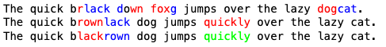

# Text Diff Utilities

**text_diff_color_utilities.py**: This script highlights differences between strings using colors:  
- **Removed text** in red  
- **Added text** in green (amend)  
- **Modified text without length change** in blue (emend)  

